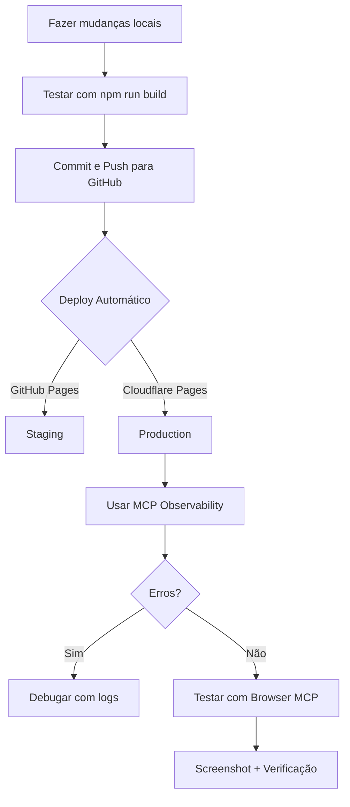

# Configuração MCP Cloudflare - Claude Code CLI

**Data:** 04/10/2025
**Versão:** 1.0

Este documento explica como usar os servidores MCP (Model Context Protocol) do Cloudflare integrados ao Claude Code CLI neste projeto.

---

## 📋 O que é MCP?

MCP (Model Context Protocol) é um protocolo aberto que conecta assistentes de IA com aplicações externas, permitindo que o Claude Code acesse diretamente recursos do Cloudflare.

**No nosso projeto, isso significa:**
- Gerenciar Cloudflare Pages diretamente do Claude Code
- Configurar builds e deployments
- Analisar logs e métricas
- Consultar documentação atualizada
- Testar o site (screenshots, rendering)

---

## ✅ O que já está configurado

O projeto já possui:

1. **Dependência instalada:**
   ```json
   // package.json
   "devDependencies": {
     "mcp-remote": "^0.1.29"
   }
   ```

2. **Arquivo de configuração:**
   ```
   .mcp.json (na raiz do projeto)
   ```

3. **5 servidores MCP configurados:**
   - `cloudflare-docs` - Documentação
   - `cloudflare-bindings` - Workers bindings
   - `cloudflare-builds` - Gerenciamento de builds
   - `cloudflare-observability` - Logs e debug
   - `cloudflare-browser` - Renderização de páginas

---

## 🔐 Autenticação (Primeira Vez)

### Passo 1: Criar API Token no Cloudflare

1. Acesse: https://dash.cloudflare.com/profile/api-tokens
2. Clique em **"Create Token"**
3. Use o template **"Edit Cloudflare Workers"** ou crie um customizado

**Permissões recomendadas:**

```
Account:
  - Account Analytics: Read
  - Workers Scripts: Read, Edit
  - Workers KV Storage: Read, Edit (se usar KV)
  - Account Settings: Read

Zone:
  - Workers Routes: Read, Edit
  - Zone: Read
  - Logs: Read (para Observability)
```

4. **Account Resources:**
   - Selecione sua conta Cloudflare
   - Include: All accounts (ou específica)

5. **TTL:**
   - Recomendado: 1 year (para desenvolvimento)

6. Clique em **"Continue to summary"** → **"Create Token"**

7. **COPIE O TOKEN** - ele só aparece uma vez!
   ```
   Exemplo: AbCdEf123456789_aBcDeFgHiJkLmNoPqRsTuVwXyZ
   ```

### Passo 2: Autenticar no Claude Code

Na primeira vez que usar um servidor MCP, o Claude Code solicitará autenticação:

```bash
# Exemplo de uso
"Use o cloudflare-docs para buscar informações sobre Pages"
```

**Fluxo OAuth:**
1. Claude Code abrirá seu navegador
2. Você fará login no Cloudflare (se não estiver)
3. Autorizará o Claude Code a acessar sua conta
4. Token será salvo automaticamente

**Ou via variável de ambiente:**
```bash
# .mcp.local.json (não commitar!)
{
  "mcpServers": {
    "cloudflare-docs": {
      "command": "npx",
      "args": ["mcp-remote", "https://docs.mcp.cloudflare.com/sse"],
      "env": {
        "CLOUDFLARE_API_TOKEN": "seu_token_aqui"
      }
    }
  }
}
```

⚠️ **ATENÇÃO:** Nunca commite `.mcp.local.json` - já está no `.gitignore`

---

## 🛠️ Servidores MCP Disponíveis

### 1. Cloudflare Docs (cloudflare-docs)

**Uso:**
```
"Consulte a documentação do Cloudflare sobre como configurar custom domains no Pages"
```

**Capabilities:**
- Buscar documentação atualizada
- Exemplos de código
- Referências de API
- Tutoriais e guias

**Endpoint:** `https://docs.mcp.cloudflare.com/sse`

---

### 2. Workers Bindings (cloudflare-bindings)

**Uso:**
```
"Configure um KV namespace para o projeto drapaulaped"
```

**Capabilities:**
- Criar e gerenciar KV namespaces
- Configurar D1 databases
- Gerenciar R2 buckets
- Configurar Durable Objects
- Service bindings

**Endpoint:** `https://bindings.mcp.cloudflare.com/sse`

**Permissões necessárias:**
- Workers Scripts: Read, Edit
- Workers KV Storage: Read, Edit

---

### 3. Workers Builds (cloudflare-builds)

**Uso:**
```
"Liste os últimos 5 builds do projeto drapaulaped no Cloudflare Pages"
"Trigger um novo build da branch main"
```

**Capabilities:**
- Listar builds históricos
- Ver status de builds (success, failed, building)
- Trigger novos builds
- Ver logs de build
- Cancelar builds em progresso

**Endpoint:** `https://builds.mcp.cloudflare.com/sse`

**Permissões necessárias:**
- Workers Scripts: Read, Edit
- Account Settings: Read

---

### 4. Observability (cloudflare-observability)

**Uso:**
```
"Mostre os erros das últimas 24 horas do site em produção"
"Analise os logs de requests com status 500"
```

**Capabilities:**
- Buscar logs de aplicação
- Filtrar por timestamp, status, método
- Analisar erros e exceções
- Ver métricas de performance
- Tail logs em tempo real

**Endpoint:** `https://observability.mcp.cloudflare.com/sse`

**Permissões necessárias:**
- Logs: Read
- Account Analytics: Read

⚠️ **NOTA:** Requer plano Workers Paid ($5/mês) para acesso completo a logs.

---

### 5. Browser Rendering (cloudflare-browser)

**Uso:**
```
"Tire um screenshot da homepage www.drapaulaped.com.br"
"Renderize a página /blog/introducao-alimentar e extraia o conteúdo"
```

**Capabilities:**
- Renderizar páginas web
- Tirar screenshots (desktop, mobile, tablet)
- Extrair HTML/conteúdo renderizado
- Executar JavaScript
- Simular diferentes dispositivos

**Endpoint:** `https://browser.mcp.cloudflare.com/sse`

**Permissões necessárias:**
- Browser Rendering: Read

⚠️ **NOTA:** Requer Workers Paid + Browser Rendering habilitado.

---

## 🚀 Casos de Uso Comuns

### 1. Setup Inicial Cloudflare Pages

```
Prompt para Claude Code:
"Use cloudflare-bindings para criar um novo projeto Pages chamado 'drapaulaped'
conectado ao repositório joaoguilhermels/drapaulaped na branch main"
```

**Claude Code executará:**
1. Criar projeto Pages
2. Configurar build settings:
   - Build command: `npm run build`
   - Build output: `out`
   - Root directory: `/`
3. Conectar ao GitHub repo

---

### 2. Configurar Variáveis de Ambiente

```
"Use cloudflare-bindings para adicionar as seguintes environment variables
ao projeto drapaulaped em production:
- NEXT_PUBLIC_SITE_URL=https://www.drapaulaped.com.br
- NEXT_PUBLIC_GA_MEASUREMENT_ID=G-63WNLD61E3
- CLOUDFLARE_ENV=production"
```

---

### 3. Monitorar Deploy

```
"Liste os últimos 3 builds do drapaulaped e mostre o status de cada um"
```

**Resposta esperada:**
```
1. Build #42 - Success - 2m ago - branch: main - commit: abc123
2. Build #41 - Failed - 1h ago - branch: feat/blog - commit: def456
3. Build #40 - Success - 3h ago - branch: main - commit: ghi789
```

---

### 4. Debug de Erros

```
"Mostre os logs de erro das últimas 2 horas do site www.drapaulaped.com.br
filtrando por status 500"
```

---

### 5. Testar Visualmente

```
"Tire screenshots da homepage em:
- Desktop (1920x1080)
- Mobile (375x667)
E compare se o layout está responsivo"
```

---

## 📊 Integrando com Workflow de Deploy

### Fluxo Recomendado



### Comandos Úteis via Claude Code

**1. Verificar último deploy:**
```
"Qual o status do último build do drapaulaped?"
```

**2. Ver logs de produção:**
```
"Mostre requests dos últimos 30 minutos no site de produção"
```

**3. Comparar ambientes:**
```
"Tire screenshot de staging e production da mesma página e compare"
```

---

## 🔧 Troubleshooting

### Problema 1: "Authentication failed"

**Causa:** Token expirado ou sem permissões

**Solução:**
1. Gerar novo token no Cloudflare Dashboard
2. Garantir permissões corretas
3. Re-autenticar via OAuth
4. Verificar se conta tem plano adequado

---

### Problema 2: "Server not found"

**Causa:** Servidor MCP não iniciou

**Solução:**
```bash
# Verificar se mcp-remote está instalado
npm list mcp-remote

# Reinstalar se necessário
npm install --save-dev mcp-remote

# Reiniciar Claude Code
```

---

### Problema 3: "Rate limit exceeded"

**Causa:** Muitas requisições em curto período

**Solução:**
- Aguardar 1 minuto
- Fazer requisições mais específicas
- Usar filtros para reduzir volume de dados

---

### Problema 4: "Observability requires paid plan"

**Causa:** Logs completos precisam de Workers Paid

**Solução:**
- Upgrade para Workers Paid ($5/mês)
- Ou usar Analytics (grátis, menos detalhado)

---

## 🌐 Servidores MCP Adicionais (Não Configurados)

Caso precise no futuro, há outros servidores disponíveis:

### Radar
- **Endpoint:** `https://radar.mcp.cloudflare.com/sse`
- **Uso:** Análise de tráfego global, tendências de Internet

### Container
- **Endpoint:** `https://containers.mcp.cloudflare.com/sse`
- **Uso:** Gerenciar containers

### Logpush
- **Endpoint:** `https://logs.mcp.cloudflare.com/sse`
- **Uso:** Exportar logs para S3, GCS, etc.

### AI Gateway
- **Endpoint:** `https://ai-gateway.mcp.cloudflare.com/sse`
- **Uso:** Gerenciar requests de modelos de IA

### AutoRAG
- **Endpoint:** `https://autorag.mcp.cloudflare.com/sse`
- **Uso:** RAG (Retrieval Augmented Generation) automático

**Para adicionar:**
```json
// .mcp.json
{
  "mcpServers": {
    "cloudflare-radar": {
      "command": "npx",
      "args": ["mcp-remote", "https://radar.mcp.cloudflare.com/sse"]
    }
  }
}
```

---

## 📚 Recursos e Links

**Documentação Oficial:**
- Cloudflare MCP: https://developers.cloudflare.com/agents/model-context-protocol/
- MCP Protocol: https://modelcontextprotocol.io/
- GitHub Repo: https://github.com/cloudflare/mcp-server-cloudflare

**APIs Úteis:**
- Cloudflare API: https://developers.cloudflare.com/api/
- Pages API: https://developers.cloudflare.com/pages/platform/api/

**Suporte:**
- Cloudflare Community: https://community.cloudflare.com/
- Discord: https://discord.gg/cloudflaredev

---

## ✅ Checklist de Setup

- [x] `mcp-remote` instalado (`package.json`)
- [x] `.mcp.json` configurado
- [x] `.gitignore` atualizado
- [ ] API Token criado no Cloudflare Dashboard
- [ ] Autenticação OAuth completa
- [ ] Teste: "Liste meus projetos Cloudflare Pages"
- [ ] Projeto Pages criado (se ainda não existe)
- [ ] Environment variables configuradas
- [ ] Primeiro deploy testado
- [ ] Logs funcionando (se plano paid)

---

## 🎯 Próximos Passos

1. **Criar API Token** - Seguir instruções acima
2. **Autenticar via OAuth** - Na primeira requisição MCP
3. **Testar MCP:**
   ```
   "Use cloudflare-docs para buscar informações sobre custom domains"
   ```
4. **Criar Projeto Pages:**
   ```
   "Crie um projeto Cloudflare Pages para www.drapaulaped.com.br"
   ```
5. **Configurar Build Settings** - Via MCP ou dashboard
6. **Deploy Manual (teste)** - Verificar se build funciona
7. **Automatizar via GitHub Actions** - Próximo documento

---

**Última Atualização:** 04/10/2025
**Responsável:** Configuração MCP Cloudflare
**Revisão:** Quando atualizar Cloudflare ou adicionar novos servidores

---

## 💡 Dicas Finais

1. **Seja específico nos prompts** - MCP funciona melhor com instruções claras
2. **Use nomes de projeto** - "drapaulaped" ao invés de "meu site"
3. **Combine MCPs** - "Use docs para pesquisar, depois bindings para configurar"
4. **Verifique permissões** - Se falhar, cheque token e plano da conta
5. **Logs são pagos** - Observability precisa Workers Paid ($5/mês)

**Exemplo de prompt efetivo:**
```
"Use cloudflare-builds para listar os builds do projeto 'drapaulaped'
das últimas 24 horas, mostre status, branch e tempo de build de cada um,
depois identifique se há algum padrão nos builds que falharam"
```

vs.

```
"Mostre os builds"  ❌ (muito genérico)
```
